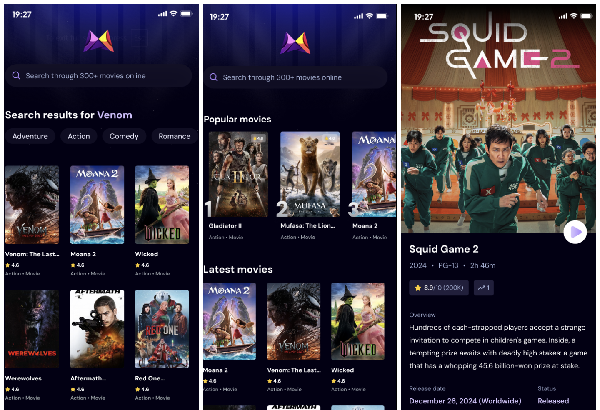

---

<h1 align="center">🎬 React Native TMDB Media Manager</h1>

<p align="center">
  
  
  
</p>
---

## 📱 Overview

**React Native TMDB Media Manager** is a cross-platform media app that enables users to:

* 📤 Upload and set a **profile picture** from local storage
* 🎞️ Save videos by providing a **movie name** and **release year**
* 🔍 Automatically fetch metadata (like artwork, overview, release date, etc.) from **TMDB API**
* 🔧 Designed to function similar to **Jellyfin** (a local media server), but built natively
* 🔐 Plans for **user authentication**, **saved libraries**, and **media sync**

---

## 🖼 Final Result

<p align="center">
  
</p>

---

## ✨ Features

* 🛠 Built with **React Native** and **Expo**
* 🎬 Fetches accurate movie metadata using **TMDB API**
* 🧾 Automatically tags saved video files with correct metadata
* 📁 Media file selection for profile image upload
* 💾 Locally stores media information (future support for cloud sync)
* 🧪 In-progress support for saved libraries and user profiles

---

## 📦 Tech Stack

| Mobile App        | Media & APIs      | State & Styling       |
| ----------------- | ----------------- | --------------------- |
| **React Native**  | **TMDB API**      | React Context API     |
| **Expo SDK**      | Local File Access | Tailwind / StyleSheet |
| Expo Image Picker |                   | AsyncStorage (WIP)    |

---

## 🚀 Getting Started

### ✅ Prerequisites

* Node.js `>=18.x`
* Expo CLI (`npm install -g expo-cli`)
* TMDB Developer API Key
* Emulator or Expo Go on a mobile device

### 🛠 Installation

```bash
git clone https://github.com/yourusername/react-native-tmdb-media-manager.git
cd react-native-tmdb-media-manager
npm install
```

Add your TMDB API key to a `.env` file:

```env
TMDB_API_KEY=your_tmdb_key_here
```

Then run the development server:

```bash
npx expo start
```

Use the QR code or an emulator to view the app.

---
## 🔧 In Progress

* [ ] Video player integration
* [ ] Authentication and profile saving
* [ ] Cloud sync support
* [ ] Auto-metadata refresh

---
## 📬 Contact

* 📧 Email: [shivendrachandel3@gmail.com](mailto:shivendrachandel3@gmail.com)
* 💻 GitHub: [github.com/Legionxoxo](https://github.com/Legionxoxo)
* 🔗 LinkedIn: [linkedin.com/in/shiv04singh](https://www.linkedin.com/in/shiv04singh)

---

